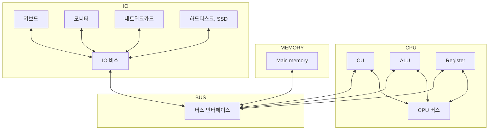

# 간단하게 알아보는 컴퓨터 구조

> 자세하게 말고 우선 간단하게 알아보자

## 1. Simple computer architecture

## 2. Complement binary operation

바이트(8bit) 단위의 2진수에서 부호있는 8비트는 -128~127이다.

즉, 0000 0000 에서 -128은 1000 0000 이고

127은 0111 1111이다. -1은 1111 1111 이다.

워드(16bit) 단위의 2진수에서 부호있는 16비트는 -32768~32767이다.

즉, 0000 0000 0000 0000에서 -32768은 1000 0000 0000 0000이다.

-32767은 1000 0000 0000 00001이고 -1은 1111 1111 1111 1111이다.

2's complement trick: 비트를 전부 반대로 바꾸고 +1한다.

## 3. Register 쪼개기

위의 구조에서 알아봤듯이 메모리에 많이 저장할 수 있으면 CPU와 거리가 점점 멀어진다.

거리가 멀어질 수록 연산해서 저장하고 되돌아오는 시간이 기하급수적으로 증가한다.

그러므로 우리는 모든 연산을 큰 메모리연산에 맡길 수 없다.

최대한 가까운 메모리를 이용해 연산하는 것을 배워보자.

64비트 기준 

RAX(64bits) => EAX(32bits) => AX(16bits) => AH(8bits-left) / AL(8bits-right)

나머지는 실습하면서.

디버그: `F5` (한번 더 누르면 break point로)

다음 스텝: `F10`

레지스터 보기: `Ctrl + R`

